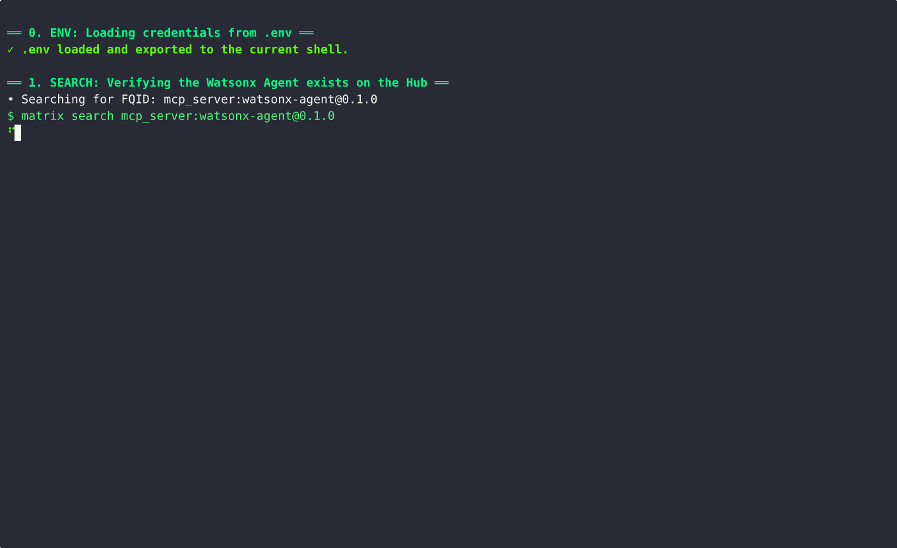

# ⚡️ Matrix CLI

*The command-line interface for **Matrix Hub** — search, inspect, install, run, probe MCP servers, manage remotes, check connectivity, and safely uninstall.*

[](https://pypi.org/project/matrix-cli/)
[](https://pypi.org/project/matrix-cli/)
[](https://github.com/agent-matrix/matrix-cli)
[](https://agent-matrix.github.io/matrix-cli/)
[](./LICENSE) <a href="https://github.com/agent-matrix/matrix-hub"></a>

> Requires **Python 3.11+** and **matrix-python-sdk ≥ 0.1.9**.

---

## 🌍 Why Matrix CLI

Matrix CLI gets you from **discovery → install → run → interact** with agents, tools, and MCP servers — fast. Built to be secure by default, delightful for developers, and friendly for automation worldwide.

---
## 🚀 What’s new in v0.1.6

Aligned with **matrix-python-sdk 0.1.9** (backwards-compatible refactor) and introduces a faster way to talk to your agents.

* **✨ New:** `matrix do <alias> <prompt>` — the quickest way to interact with a running agent.
* **Smarter runner discovery:** Auto-materializes `runner.json` from embedded b64/URL/object, embedded manifests (v1/v2), on-disk search, or inference (`server.py`, `package.json`). Synthesizes connector runners if an MCP URL is present.
* **Safer materialization:** Writes only under your target; supports base64 files, git/http artifacts; robust logging.
* **Faster environment prep:** Python: fresh venv + upgraded `pip/setuptools/wheel`, then `requirements.txt` or editable `pyproject.toml` / `setup.py`. Node: auto-detects **pnpm > yarn > npm**.
* **Connector-aware run (attach mode):** If `runner.json` is a connector with an MCP SSE URL, `matrix run` attaches (no local process). `matrix stop` becomes a no-op (clears the lock).
* **Better MCP probing & calls:** Tolerates `/sse` vs `/messages/`, clearer errors, `--json` for scripts.
* **Idempotent installs:** Re-install same alias with `--force --no-prompt` without surprises.

> Tip: `export MATRIX_SDK_DEBUG=1` for verbose installer logs.




---

## 🎬 A 5-Minute End-to-End Demo

Experience the full lifecycle with a Watsonx agent — from search to results.

### 0) Setup

Create a local `.env` with your credentials:

```bash
# .env
WATSONX_API_KEY="your_api_key_here"
WATSONX_URL="your_url_here"
WATSONX_PROJECT_ID="your_project_id_here"
```

### 1) 🔍 Discover

```bash
matrix search "watsonx" --type mcp_server --limit 5
```

### 2) 📦 Install

```bash
matrix install mcp_server:watsonx-agent@0.1.0 --alias watsonx-chat
```

### 3) 🚀 Run

```bash
matrix run watsonx-chat --port 6288
# ✓ URL:   http://127.0.0.1:6288/sse
#   Health: http://127.0.0.1:6288/health
```

### 4) ✨ Ask with **matrix do**

```bash
matrix do watsonx-chat "Tell me about Genoa"
```

### 5) ⚙️ Advanced call

```bash
matrix mcp call chat --alias watsonx-chat --args '{"query":"List three landmarks in Genoa"}'
```

### 6) 📋 Manage & clean up

```bash
matrix ps
matrix stop watsonx-chat
matrix uninstall watsonx-chat -y
```

---

## 📦 Install

`matrix-cli` is cross-platform (Linux, macOS, **Windows**). The **recommended**
install on every OS is **pipx**, which puts the CLI in its own isolated
environment and avoids clobbering console scripts in a shared/global Python
(the #1 cause of Windows install failures — see Troubleshooting).

```bash
# Recommended — isolated, works the same on Linux/macOS/Windows
pipx install matrix-cli

# Add MCP probing (SSE + WebSocket) when you need `matrix mcp probe/call`
pipx install "matrix-cli[mcp]"
```

Prefer pip? **Always use a virtual environment** — never install into the
global/system Python:

```bash
# Linux/macOS
python3 -m venv .venv && source .venv/bin/activate
pip install -U pip && pip install matrix-cli
```

```powershell
# Windows (PowerShell)
py -m venv .venv; .venv\Scripts\Activate.ps1
python -m pip install -U pip; pip install matrix-cli
```

> The base install is intentionally lightweight (typer, rich, httpx, requests,
> matrix-python-sdk). MCP probing deps (`mcp`, `websockets`) ship in the
> `[mcp]` extra and are loaded on demand.

### Optional extras

```bash
# Add MCP client (SSE works; WebSocket needs `websockets`)
pip install "matrix-cli[mcp]"   # installs mcp>=1.13.1 + websockets

# Dev extras (linting, tests, docs)
pip install "matrix-cli[dev]"

# Using pipx? Inject extras later:
pipx inject matrix-cli mcp websockets
```

---

## ⚙️ Configuration

The CLI reads, in order: **environment variables**, `~/.config/matrix/cli.toml` (optional), then built-ins.

### Environment

```bash
export MATRIX_HUB_BASE="https://api.matrixhub.io"   # or your dev hub
export MATRIX_HUB_TOKEN="..."                       # optional
export MATRIX_HOME="$HOME/.matrix"                  # optional; default ~/.matrix

# TLS (corporate CA/proxy)
export SSL_CERT_FILE=/path/to/ca.pem
# or
export REQUESTS_CA_BUNDLE=/path/to/ca.pem

# ps URL host override (display only)
export MATRIX_PS_HOST="localhost"

# Installer / builder verbosity (SDK ≥ 0.1.9)
export MATRIX_SDK_DEBUG=1
```

### Optional TOML (`~/.config/matrix/cli.toml`)

```toml
hub_base = "https://api.matrixhub.io"
token    = ""
home     = "~/.matrix"
```

---

## 🏁 Quick start

```bash
# Basics
matrix --version
matrix version

# Search (includes pending by default)
matrix search "hello"

# Filtered search
matrix search "hello" --type mcp_server --limit 5

# Install (short name resolves to mcp_server:<name>@<latest>)
matrix install hello-sse-server --alias hello-sse-server

# Run and interact
matrix run hello-sse-server
matrix do hello-sse-server "What is Matrix CLI?"

# Inspect
matrix ps                                # shows URL column
matrix logs hello-sse-server -f
matrix stop hello-sse-server

# Show raw details
matrix show mcp_server:hello-sse-server@0.1.0

# Hub health (human / JSON for CI)
matrix connection
matrix connection --json --timeout 3.0
```

**Demo GIFs**


---

## 🔍 Search tips

Useful filters:

* `--type {agent|tool|mcp_server}`
* `--mode {keyword|semantic|hybrid}`
* `--capabilities rag,sql`
* `--frameworks langchain,autogen`
* `--providers openai,anthropic`
* `--with-snippets`
* `--certified` (registered/certified only)
* `--json` for programmatic output
* `--exact` to fetch a specific ID

Examples:

```bash
# MCP servers about "hello"
matrix search "hello" --type mcp_server --limit 5

# Hybrid mode with snippets
matrix search "watsonx" --mode hybrid --with-snippets

# Structured results
matrix search "sql agent" --capabilities rag,sql --json
```

If the public Hub is unreachable, some operations try a **local dev Hub** once and tell you.

---

## 🧩 Install behavior (safer by design)

* Accepts `name`, `name@ver`, `ns:name`, `ns:name@ver`.
* If `ns` missing, prefers **`mcp_server`**.
* If `@version` missing, picks **latest** (stable > pre-release).
* Uses a small cache under `~/.matrix/cache/resolve.json` (per-hub, short TTL).
* **No absolute paths sent to the Hub** — the CLI sends a safe `<alias>/<version>` label, then **materializes locally**.
* Preflight checks ensure your local target is **writable** before network calls.

Examples:

```bash
# Short name; alias is optional (auto-suggested if omitted)
matrix install hello-sse-server --alias hello-sse-server

# Specific version
matrix install mcp_server:hello-sse-server@0.1.0

# Custom target
matrix install hello-sse-server --target ~/.matrix/runners/hello-sse-server/0.1.0
```

---

## ▶️ Run, interact, and probe

`matrix run <alias>` prints a click-ready **URL** and **Health** link, plus a logs hint.

```bash
# Instant interaction
matrix do <alias> "Your question here"

# Probe tools exposed by your local MCP server (auto-discovers port)
matrix mcp probe --alias <alias>

# Call a tool (optional args as JSON)
matrix mcp call <tool_name> --alias <alias> --args '{"key":"value"}'
```

---

## 🔗 Connector mode (attach to a remote/local MCP)

If you already have an MCP server listening (e.g. on `http://127.0.0.1:6289/sse`), **attach** to it without starting a local process by using a **connector runner**:

`~/.matrix/runners/<alias>/<version>/runner.json`:

```json
{
  "type": "connector",
  "name": "watsonx-chat",
  "description": "Connector to Watsonx MCP over SSE",
  "integration_type": "MCP",
  "request_type": "SSE",
  "url": "http://127.0.0.1:6289/sse",
  "endpoint": "/sse",
  "headers": {}
}
```

Then:

```bash
matrix run watsonx-chat
matrix ps           # shows URL (PID=0 attach mode)
matrix mcp probe --alias watsonx-chat
matrix mcp call chat --alias watsonx-chat --args '{"query":"Hello"}'
```

> In connector mode, `matrix stop` simply clears the lock (no local process to kill).

---

## 🧪 MCP utilities (SSE/WS)

Probe and call tools on MCP servers.

```bash
# Probe by alias (auto-discovers port; infers endpoint)
matrix mcp probe --alias hello-sse-server

# Or probe by full SSE URL
matrix mcp probe --url http://127.0.0.1:52305/messages/

# Call a tool (optional args as JSON)
matrix mcp call hello --alias hello-sse-server --args '{}'

# JSON mode for scripts
matrix mcp probe --alias hello-sse-server --json
```

Notes:

* SSE works with `mcp>=1.13.1` (installed via the `mcp` extra).
* WebSocket URLs (`ws://`/`wss://`) require the `websockets` package.
* If a call fails, the CLI helps by listing tools and tolerates `/sse` vs `/messages/` endpoints.

---

## 🧭 Process management

`matrix ps` shows a **URL** column built from the runner’s port and endpoint (default `/messages/`).

```
┏━━━━━━━━━━━━━━━━━━┳━━━━━━┳━━━━━━━┳━━━━━━━━━━┳━━━━━━━━━━━━━━━━━━━━━━━━━━━━━━━━━━┳━━━━━━━━━━━━━━━━━━━━━━━━━━━━━━━━━━┓
┃ ALIAS            ┃  PID ┃  PORT ┃ UPTIME   ┃ URL                              ┃ TARGET                           ┃
┡━━━━━━━━━━━━━━━━━━╇━━━━━━╇━━━━━━━╇━━━━━━━━━━╇━━━━━━━━━━━━━━━━━━━━━━━━━━━━━━━━━━╇━━━━━━━━━━━━━━━━━━━━━━━━━━━━━━━━━━┩
│ hello-sse-server │ 1234 ┃ 52305 ┃ 02:18:44 │ http://127.0.0.1:52305/messages/ │ ~/.matrix/runners/hello…/0.1.0   │
└──────────────────┴──────┴───────┴──────────┴──────────────────────────────────┴──────────────────────────────────┘
```

Copy the URL directly into:

```bash
matrix mcp probe --url http://127.0.0.1:52305/messages/
```

Script-friendly output:

```bash
# Plain (space-delimited): alias pid port uptime_seconds url target
matrix ps --plain

# JSON: array of objects with {alias,pid,port,uptime_seconds,url,target}
matrix ps --json
```

Other commands:

```bash
matrix logs <alias> [-f]
matrix stop <alias>
matrix doctor <alias>
```

---

## 🌐 Hub health & TLS

```bash
# Quick Hub health
matrix connection
matrix connection --json
```

TLS policy:

* Respects `REQUESTS_CA_BUNDLE` / `SSL_CERT_FILE`.
* Tries OS trust (when available).
* Falls back to `certifi`.
* Never throws on network errors in health checks — returns a structured status with exit codes.

---

## 🧹 Safe uninstall

Remove one or many aliases, and optionally purge local files.

```bash
# Uninstall one alias (keeps files by default)
matrix uninstall hello-sse-server

# Uninstall several and also delete files (safe paths only)
matrix uninstall hello-a hello-b --purge

# Remove everything from the local alias store (stop first, purge files)
matrix uninstall --all --force-stop --purge -y

# Dry-run (show what would be removed)
matrix uninstall --all --dry-run
```

Safety features:

* Only purges targets under `~/.matrix/runners` by default.
* Skips deleting files still referenced by other aliases.
* `--force-files` allows deleting outside the safe path (⚠️ **dangerous**; off by default).
* `--stopped-only` to avoid touching running aliases.

Exit codes: **0** success, **2** partial/failed.

---

## 🧰 Scripting & CI examples

```bash
# Search, parse with jq, then install the first result
results=$(matrix search "ocr table" --type tool --json)
first_id=$(echo "$results" | jq -r '.items[0].id')
matrix install "$first_id" --alias ocr-table --force --no-prompt

# Health check in CI (exit code 0/2)
matrix connection --json

# Get the port quickly for an alias
port=$(matrix ps --plain | awk '$1=="hello-sse-server"{print $3; exit}')
matrix mcp probe --url "http://127.0.0.1:${port}/messages/" --json
```

---

## 🐞 Troubleshooting

* **Windows install fails with `WinError 2 … '…\\Scripts\\dotenv.exe' -> '…dotenv.exe.deleteme'`** (or the same for `python-multipart`, `uvicorn`, etc.) — This is **pip being unable to replace a console script in a global/system Python** (e.g. `C:\Python311`). It is not a bug in `matrix-cli`; it happens when a dependency such as `python-dotenv` must be upgraded and its `.exe` is locked or not writable. Fixes, in order of preference:
  1. **Use pipx** (isolated env — recommended): `pipx install matrix-cli`. If you already started down the pip path, `pip uninstall -y matrix-cli` first.
  2. **Use a virtualenv** instead of the global Python:
     ```powershell
     py -m venv .venv; .venv\Scripts\Activate.ps1
     python -m pip install -U pip; pip install matrix-cli
     ```
  3. **Pre-upgrade the stuck package, then retry** (clears the locked `.exe` first): `python -m pip install -U python-dotenv` then `pip install matrix-cli`.
  4. **Force a clean reinstall**: `pip install --no-cache-dir --force-reinstall matrix-cli`.
  5. If you must use the global Python, close any process using `dotenv`/the Scripts dir (terminals, editors, antivirus scans) and run the shell **as Administrator**, or use `pip install --user matrix-cli`.
* **“Missing 'mcp' package”** — MCP probing is an optional extra now: `pip install "matrix-cli[mcp]"` (installs `mcp` + `websockets`). The base install stays lightweight.
* **TLS / certificate errors** — Set `SSL_CERT_FILE` or `REQUESTS_CA_BUNDLE` to your CA bundle.
* **Alias not found when probing** — Use the alias shown by `matrix ps` (case-insensitive), or pass `--url` directly.
* **Connector mode shows PID=0** — Expected in attach mode; ensure the remote server is running.

---

## 🛠️ Development

```bash
# Create venv and install (editable) with useful extras
python3.11 -m venv .venv
source .venv/bin/activate
pip install -U pip
pip install -e ".[dev,mcp]"

# Common tasks
make lint       # ruff/flake8
make fmt        # black
make typecheck  # mypy
make test       # pytest
make build      # sdist + wheel
```

---

## 🌍 About MatrixHub

MatrixHub aims to be the **pip of agents & MCP servers** — a secure, open, and developer-friendly registry and runtime that scales from personal laptops to global enterprises. If you’re building agents, tools, or MCP services, Matrix CLI gets you from idea to running in seconds.

---

## 📄 License

Apache License 2.0

---

## ✉️ Feedback

Issues and PRs welcome! If you hit rough edges with install/probing/health, the new **connector** flow, or `ps --plain/--json` and `uninstall`, please open an issue with your command, output, and environment.

* GitHub: [https://github.com/agent-matrix/matrix-cli](https://github.com/agent-matrix/matrix-cli)
* PyPI: [https://pypi.org/project/matrix-cli/](https://pypi.org/project/matrix-cli/)
