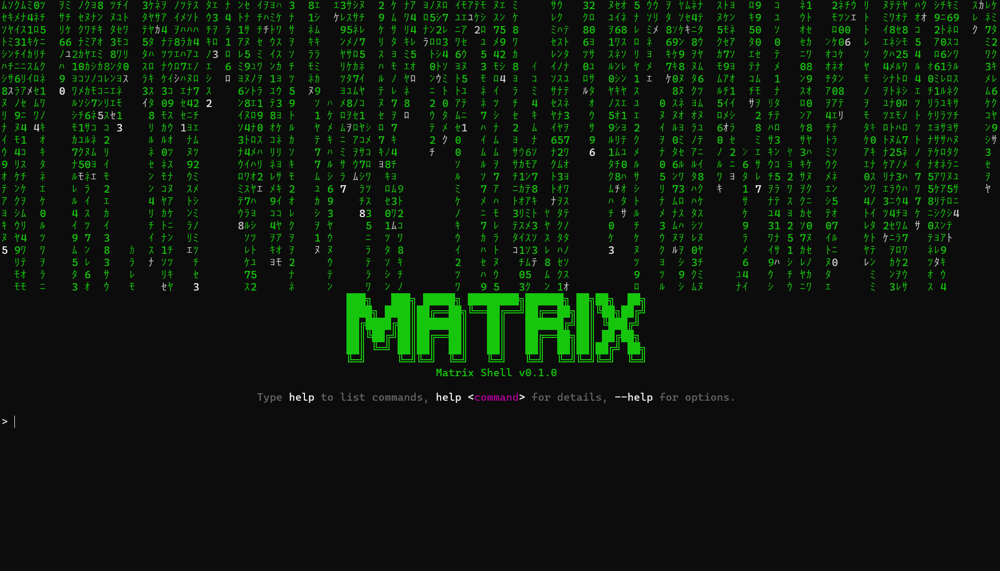

<!-- docs/index.md -->

# Welcome to Matrix CLI


The **Matrix CLI** is your gateway to the **Matrix Hub** catalog.

Use it to:

- 🔍 **Search** for agents, tools, and MCP-Servers  
- 📋 **Show** full details for any entity  
- 🛠️ **Install** agents/tools into your projects  
- 📑 **List** what’s registered in your Hub or Gateway  
- 🔄 **Manage** multiple catalog remotes  
- 💬 **Matrix Shell (REPL)** for an interactive experience  
- 🌧️ **Screensaver** (Matrix rain) — press any key to return

---

## Features

- **REPL-first UX**: type `matrix` to enter the Matrix Shell  
- **Robust autocompletion** (works even when options come first)
- **Global options** available at startup *and* inside REPL:
  - `--version` prints CLI version
  - `--rain / --no-rain` toggle startup animation
  - `--no-repl` run and exit without starting the shell
- **Help won’t clear the screen**; use `clear` when you want a fresh view
- **Clean exit** via `exit`, `quit`, `close`, or `matrix exit`

---

## Quick Start

### 1) Install

```bash
# Recommended
pipx install matrix-cli

# Or
pip install matrix-cli
```

> Requires Python 3.11+

### 2) Configure

Create `~/.matrix/config.toml`:

```toml
[registry]
base_url = "http://localhost:7300"
token = "YOUR_MATRIX_TOKEN"      # optional

[gateway]
base_url = "http://localhost:7200"
token = "YOUR_GATEWAY_TOKEN"     # optional

[cache]
dir = "~/.cache/matrix"
ttl_seconds = 14400               # 4 hours
```

Environment overrides:

```bash
export MATRIX_BASE_URL=http://hub.example.com
export MATRIX_TOKEN=...
export MCP_GATEWAY_URL=http://gateway.example.com
export MCP_GATEWAY_TOKEN=...
export MATRIX_CACHE_DIR=~/.cache/matrix
export MATRIX_CACHE_TTL=14400
```

Command-line overrides:

```bash
matrix --base-url http://hub.example.com search "pdf summarizer"
```

### 3) Explore

```bash
# Enter REPL
matrix

# Or one-shot usage
matrix --version
matrix search "pdf" --type agent --limit 5
```

---

## Matrix Shell (REPL)

Inside the REPL:

* `help` or `matrix help`
* `help <command>`
* `clear` or `matrix clear`
* `exit`, `quit`, `close`, or `matrix exit`
* `--rain` / `--no-rain` toggles animation for the current session
* `screensaver` shows Matrix rain; **press any key** to return; prior output is preserved

> Typing a redundant `matrix` at the start is accepted (e.g., `matrix exit`).

---

## Troubleshooting

* **No such command '--no-rain'** inside REPL → fixed; options-first is supported.
* **Version in REPL** → `--version` works and returns cleanly.
* **Help clears the screen** → not anymore; by design help preserves your context.
* **Auth errors** → ensure `MATRIX_TOKEN` is configured if your Hub requires it.

---

## Links

* Matrix Hub backend (FastAPI)
* Matrix Python SDK (typed HTTP client)
* This CLI repository


